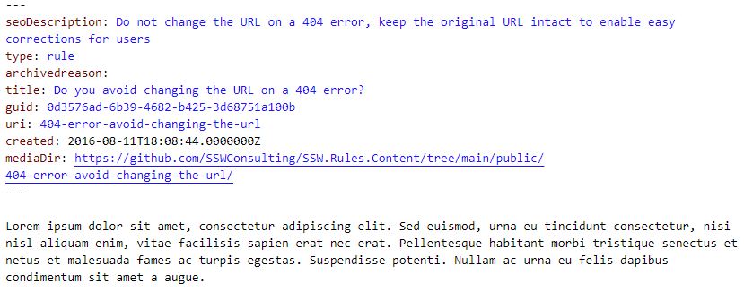

# 🧩 Problem: Markdown and Images Separation in TinaCMS + Next.js

By default:
- Markdown files live in `content/rules/`
- Images are uploaded to `public/uploads/`

❌ This breaks self-containment – content and its assets are split.


## 🎯 Goal

Each rule should live in **its own folder** with:
- `rule.md` (or `.mdx`)
- Embedded images (e.g. `img.png`)

Ideal structure:
```
content/
└── rules/
    ├── rule-a/
    │   ├── rule.md
    │   └── img.png
    └── rule-b/
        ├── rule.md
        └── img.png
```

---

## Option 1 — Default Setup + Matching Folders

- Markdown in `content/rules/rule-a/rule.md`
- Images in `public/uploads/rule-a/`
- Add link to image folder in frontmatter
\
\


✅ Works out of the box  
✅ Tina Media Manager works as expected  
❌ Not truly self-contained  
❌ Needs naming sync between folders
 


**Figure: example frontmatter with link to image**

---

## Option 2 — Everything in `/content/rules`

Structure:
```
content/
└── rules/
    ├── rule-a/
    │   ├── rule.md
    │   └── img.png
    └── rule-b/
        ├── rule.md
        └── img.png
```

✅ Self-contained  
✅ Tina Media Manager works  
❌ Media are stored in an unusual folder  
❌ Need extra dev to make it work locally (Middleware)

---

## ⭐ Option 3 (recommended) — Everything in `/public/uploads/rules`

Structure:
```
public/
└── uploads/
    └── rules/
        ├── rule-a/
        │   ├── rule.md
        │   └── img.png
        └── rule-b/
            ├── rule.md
            └── img.png
```

✅ Self-contained  
✅ Tina Media Manager works  
✅ No hacks/scripts  
❗ `.mdx` files live in public, which is unconventional